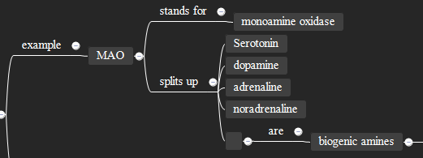
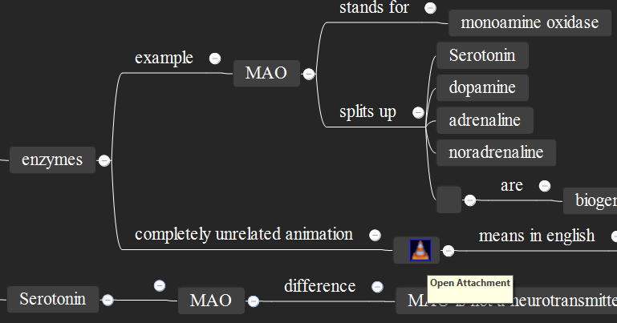

## Stepwise Map Retrieval

#### Table of Contents  
**[1. Creating a concept map](https://github.com/Humorloos/SMR#1-creating-a-concept-map)**  

[Bridges](https://github.com/Humorloos/SMR#bridges) 
[Questions following multiple Answers](https://github.com/Humorloos/SMR#questions-following-multiple-answers) 
[Multimedia](https://github.com/Humorloos/SMR#multimedia) 
[Answer Limit](https://github.com/Humorloos/SMR#answer-limit) 

**[2. Importing your concept maps](https://github.com/Humorloos/SMR#2-importing-your-concept-maps)** 

[Import Errors](https://github.com/Humorloos/SMR#import-errors) 

**[3. Synchronizing your concept maps](https://github.com/Humorloos/SMR#3-synchronizing-your-concept-maps)** 

[Repair Checkbox](https://github.com/Humorloos/SMR#repair-checkbox) 

**[4. Reviewing your cards](https://github.com/Humorloos/SMR#4-reviewing-your-cards)**

### 1. Creating a concept map
Stepwise Map Retrieval (SMR) imports and synchronizes concept maps written in [Xmind8](https://www.xmind.net/download/xmind8), so the first thing you want to do is write a concept map from the content you want to learn.

[Concept maps](https://en.wikipedia.org/wiki/Concept_map) consist of concepts and relationships. 
However, since Xmind 8 originally is a mind mapping software, you will write both concepts and relationships into nodes. 
SMR recognizes concepts and relationships by their position on the map.
It considers nodes at even levels (e.g. "biological psychology" or "perception" in the example sheet "biological psychology") concepts and nodes at odd levels (e.g. "investigates" in the same sheet) relationships.

To be able to distinguish relationships and concepts, I recommend you style relationship nodes with a straight line and set a custom key (preferences -> Keys -> Paste Style) for pasting node styles (I use ctrl + G). 
I usually use logic chart structure for my concept maps, but for SMR to work, any structure should be fine.

#### Bridges
If you want to structure your concept map without creating any cards, you can place an empty relationship between two concepts:

#### Questions following multiple Answers
To include questions following multiple answers, you can place an empty concept next to the answers the relationship is supposed to refer to and add the question to that concept:

#### Multimedia
SMR supports import of images, sound files (mp3, wav) and videos (mp4):

#### Answer Limit
If a concept map contains questions with more than 20 answers, the import will not work. However, there is no limit to the number of questions following an answer.

### 2. Importing your concept maps
To import a concept map all you have to do is click the "Import File" button at the bottom of the main window and choose the Xmind file that contains the map you want to import.
The dialogue that pops up will let you choose the deck you want to import the notes to.
After confirming the dialog, SMR will import the first sheet in the file into Anki.
Other sheets will be ignored.
SMR will assign a tag consisting of the deck's name and the imported sheet's name.
The tags are built hierarchically, i.e., if you import multiple different sheets into the same deck, you can find the cards belonging to sheets in the same deck under that deck's name in the browser.

#### Import Errors
If your concept map has an error (e.g., a question without answers, or two concepts directly following each other without a bridge between them), the import will fail and SMR will show an error message similar to this:

The "Path" in the error message gives a hint, where the error is located.
To find the error, you must proceed as follows:
- Start at the root concept in your map ("biological psychology" in the example)
- Go to the n-th child node of this concept, where n is the first number in the path ("investigates" in the example, because it is the second child of the root concept)
- Continue navigating down in your map, following the numbers in the path seperated by points (e.g., in the second step in the example, I would navigate to the first child node of"investigates", which is "information transfer and processing")
- Stop when you have found the error, which may not be located at the end of the path.

### 3. Synchronizing your concept maps

#### Importing changes in your concept map
To import changes made to your concept maps into your anki notes, all you have to do is import the corresponding map again.

#### Exporting changes to your cards
Changes made to questions or answers in your SMR cards will be exported to your concepts map when you click the "SMR Sync" button in the start menu. 
This feature currently only works with images and text changes. 
SMR can not yet export changes to audio files, videos, or any other content. 

#### Repair checkbox
Sometimes Xmind 8 experiences some serious bugs with the program crashing every time you try to edit a concept map.
The only solution to this problem that I have found until now is to open the map with [Xmind Zen](https://www.xmind.net/download/), make the necessary changes, save it from there and open it again in Xmind 8.
However, after doing this, SMR will no more recognize the concept map and won't synchronize an existing map but import it again. 
To be able to synchronize again, you need to import the map once with the repair checkbox checked. 
However, make sure that the map is the same as before you saved it in Xmind Zen because any notes affected by changes will be removed and imported again and your progress could be lost.

### 4. Reviewing your cards
SMR comes with a custom reviewing algorithm that roughly follows these preferences:
1. The first note you study will always be the note at the highest hierarchy level
2. If a note contains multiple answers, the first due answer will always be asked first, followed by subsequent answers
3. If a note has children (questions following answers), they will be asked next. If none are due, children of children will be asked etc.
4. If a note has Siblings (questions following the same parent node), they will be asked next.
5. If no more subsequent notes are left, Anki will present you another note at the highest hierarchy level.

If there are multiple notes with the same priority, "learning" cards will be chosen first, then "review" cards and then "new" cards.
